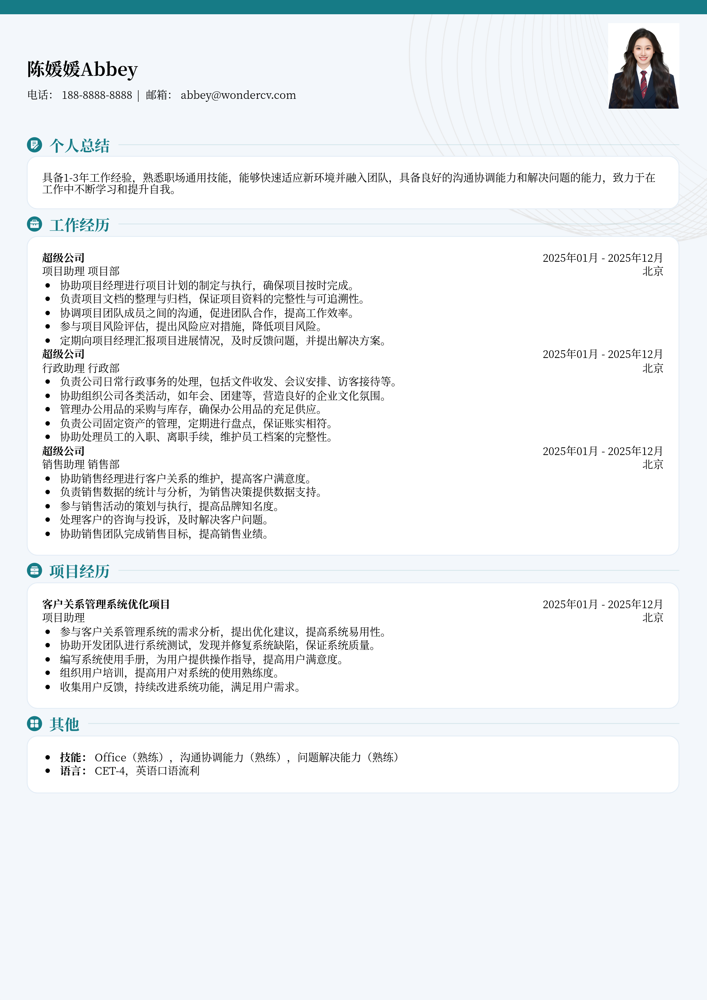

# 社会招聘通用简历模板

> 社会招聘通用简历模板，适合1～3年招聘投递，也适合其他相关岗位简历参考

## 模板信息

| 项目 | 内容 |
|------|------|
| 适用岗位 | 社招简历、简历范文、求职简历模板 |
| 语言 | 中文 |
| ATS 友好 | ✅ 是 |
| 已使用 | 891,253 次 |

## 标签

`社招简历` `简历范文` `求职简历模板`

## 模板特点

## 模板说明

这款社会招聘通用简历模板是专为有1-3年工作经验的职场人士设计的，同时也适用于其他岗位的求职者参考。它采用简洁明了的设计风格，重点突出您的工作经验和技能，帮助您在众多应聘者中脱颖而出。模板结构清晰，易于编辑，您可以根据自己的实际情况进行个性化修改，例如调整模块顺序、修改配色方案等。无论您是寻求职业发展，还是想跳槽到更好的平台，这份模板都能助您一臂之力。它能有效展示您的专业能力和职业素养，让HR眼前一亮。您可通过下方的模板摘取您需要的内容，然后使用我们AI驱动的简历生成器生成简历。

- 通用性强，适用多种岗位
- 简洁专业，突出重点信息
- 易于编辑，个性化定制
- 结构清晰，逻辑性强
- 提升简历竞争力，增加面试机会

## 适用场景

- 校招 / 社招投递
- 简历换新 / 定向改写
- 投递互联网、金融、咨询等主流行业

## 如何使用

1. 点击下方链接打开超级简历编辑器
2. 选择此模板，填写个人信息
3. 导出 PDF，直接投递

[👉 立即使用此模板](https://wondercv.com/sample/eBTxk7rz)

---

> 更多模板：[超级简历模板库](https://github.com/WonderCV-com/resume-templates) | 官网：[wondercv.com](https://wondercv.com)
