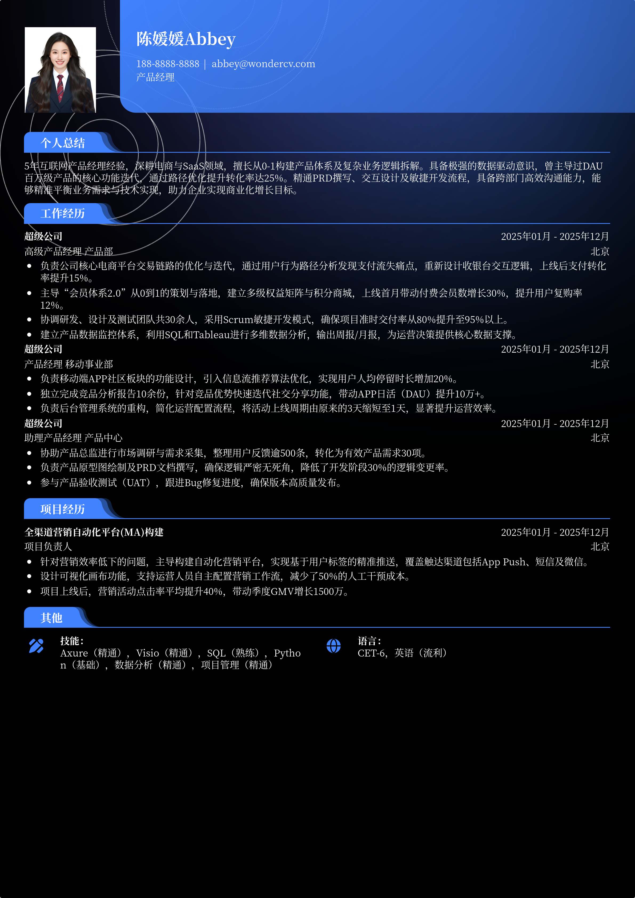

# 3-5年经验产品经理求职简历模板

> 3-5年经验产品经理求职简历模板产品经理简历模板，适合工作3～5年招聘投递，也适合其他相关岗位简历参考

## 模板信息

| 项目 | 内容 |
|------|------|
| 适用岗位 | 社招简历、产品经理简历模板、数据分析、互联网 |
| 语言 | 中文 |
| ATS 友好 | ✅ 是 |
| 已使用 | 864,251 次 |

## 标签

`社招简历` `产品经理简历模板` `数据分析` `互联网`

## 模板特点

## 模板说明

这款3-5年经验产品经理求职简历模板专为处于职业上升期的互联网从业者设计。针对社招场景，模板重点强化了项目深度、数据驱动能力以及商业闭环思维的展示。无论您是深耕C端用户体验，还是专注B端逻辑架构，该模板都能帮助您清晰呈现从需求调研、产品设计到上线迭代的全生命周期管理经验。其结构科学，能有效突出中高级产品经理应具备的行业洞察力与团队协作能力。您可通过下方的模板摘取您需要的内容，然后使用我们AI驱动的简历生成器生成简历。

- 量化数据分析，直观体现增长成果
- 突出产品全生命周期管理核心能力
- 结构化排版，适配互联网名企筛选
- 深度挖掘项目价值，彰显商业逻辑
- 强调跨部门协作与团队领导力表现

## 适用场景

- 校招 / 社招投递
- 简历换新 / 定向改写
- 投递互联网、金融、咨询等主流行业

## 如何使用

1. 点击下方链接打开超级简历编辑器
2. 选择此模板，填写个人信息
3. 导出 PDF，直接投递

[👉 立即使用此模板](https://wondercv.com/resumes/new?sample_cv_token=0aa3e6062b83534f)

---

> 更多模板：[超级简历模板库](https://github.com/WonderCV-com/resume-templates) | 官网：[wondercv.com](https://wondercv.com)
