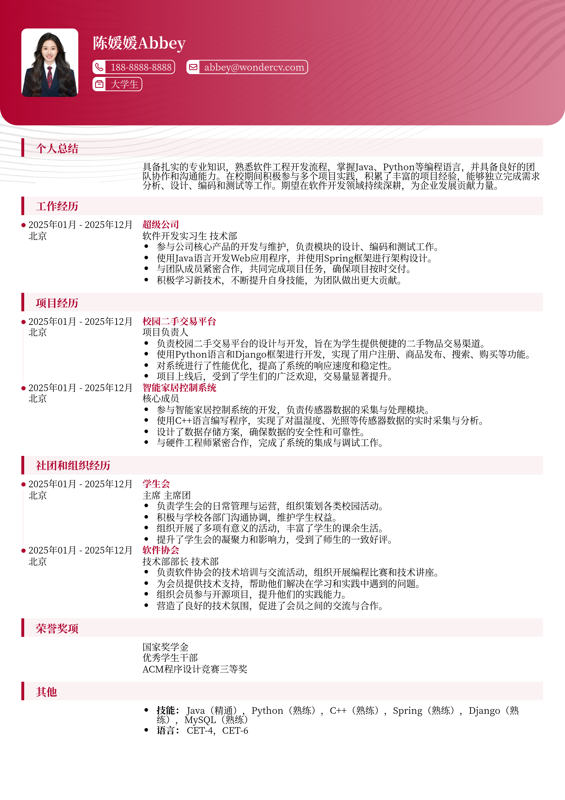

# 西安交通大学大学生简历模板

> 西安交通大学大学生简历模板，大学生简历模板，适合应届生招聘投递，也适合其他相关岗位简历参考

## 模板信息

| 项目 | 内容 |
|------|------|
| 适用岗位 | 大学生简历模板、校招简历、免费简历模板 |
| 语言 | 中文 |
| ATS 友好 | ✅ 是 |
| 已使用 | 789,562 次 |

## 标签

`大学生简历模板` `校招简历` `免费简历模板`

## 模板特点

## 模板说明

这款“西安交通大学大学生简历模板”专为应届毕业生设计，同时也适用于其他岗位的求职者参考。它采用简洁现代的设计风格，突出重点信息，方便HR快速了解您的优势。模板结构清晰，包含教育背景、项目经验、实习经历、技能特长等常用模块，您可以根据自身情况灵活调整。无论您是工科、理科、文科还是商科背景，都可以轻松使用此模板打造一份专业的求职简历。它不仅注重内容呈现，更关注视觉效果，力求让您的简历在众多竞争者中脱颖而出。本模板旨在帮助您高效展示个人能力，提升求职成功率。您可通过下方的模板摘取您需要的内容，然后使用我们AI驱动的简历生成器生成简历。

- 专为大学生设计，贴合校招需求
- 简洁现代风格，突出重点信息
- 结构清晰，模块化设计易于编辑
- 适用于不同专业背景的求职者
- 提升简历专业度，助力求职成功

## 适用场景

- 校招 / 社招投递
- 简历换新 / 定向改写
- 投递互联网、金融、咨询等主流行业

## 如何使用

1. 点击下方链接打开超级简历编辑器
2. 选择此模板，填写个人信息
3. 导出 PDF，直接投递

[👉 立即使用此模板](https://wondercv.com/sample/TwzVthgS)

---

> 更多模板：[超级简历模板库](https://github.com/WonderCV-com/resume-templates) | 官网：[wondercv.com](https://wondercv.com)
