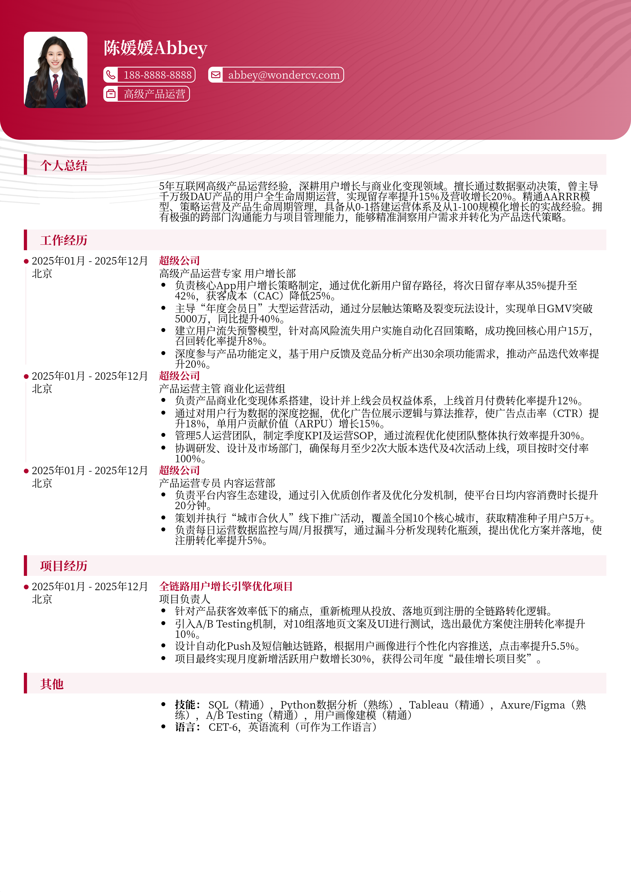

# 3-5年经验高级产品运营跳槽简历模板

> 3-5年经验高级产品运营跳槽简历模板高级产品运营简历模板，适合工作3～5年招聘投递，也适合其他相关岗位简历参考

## 模板信息

| 项目 | 内容 |
|------|------|
| 适用岗位 | 社招简历、运营简历模板、数据分析、互联网 |
| 语言 | 中文 |
| ATS 友好 | ✅ 是 |
| 已使用 | 865,432 次 |

## 标签

`社招简历` `运营简历模板` `数据分析` `互联网`

## 模板特点

## 模板说明

这款3-5年经验高级产品运营跳槽简历模板，专为处于职业上升期的互联网人打造。它深度契合高级运营岗位的市场需求，强调“数据驱动”与“策略落地”两大核心能力。模板不仅科学划分了项目经验与工作模块，更提供了规范的量化成果表达方式，帮助您在激烈的社招竞争中精准展现职业成熟度。无论是转战大厂还是寻求职级跃迁，该模板都能助力您快速构建逻辑严密的专业形象。您可通过下方的模板摘取您需要的内容，然后使用我们AI驱动的简历生成器生成简历。

- 科学布局，完美适配3-5年社招需求
- 突出数据分析能力，强化运营专业度
- 模块化结构，清晰呈现复杂项目经验
- 专业术语规范，提升简历系统筛选率
- 视觉清爽简洁，符合一线大厂审美标准

## 适用场景

- 校招 / 社招投递
- 简历换新 / 定向改写
- 投递互联网、金融、咨询等主流行业

## 如何使用

1. 点击下方链接打开超级简历编辑器
2. 选择此模板，填写个人信息
3. 导出 PDF，直接投递

[👉 立即使用此模板](https://wondercv.com/resumes/new?sample_cv_token=23edcee9e7c09b89)

---

> 更多模板：[超级简历模板库](https://github.com/WonderCV-com/resume-templates) | 官网：[wondercv.com](https://wondercv.com)
