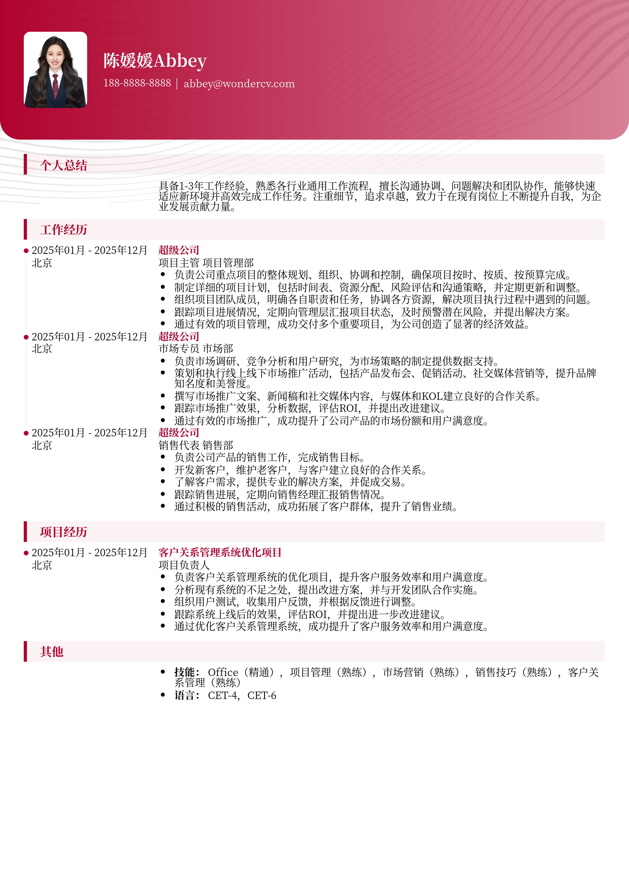

# 在职提升通用简历模板

> 在职提升通用简历模板，适合1～3年招聘投递，也适合其他相关岗位简历参考

## 模板信息

| 项目 | 内容 |
|------|------|
| 适用岗位 | 社招简历、跳槽简历、简历范文、求职简历模板 |
| 语言 | 中文 |
| ATS 友好 | ✅ 是 |
| 已使用 | 813,563 次 |

## 标签

`社招简历` `跳槽简历` `简历范文` `求职简历模板`

## 模板特点

## 模板说明

这款“在职提升通用简历模板”是专为希望在现有岗位上获得晋升或寻求更好职业发展的职场人士设计的。它简洁明了，重点突出，能够帮助你在众多应聘者中脱颖而出。模板适用于1-3年工作经验的求职者，同时也适合其他有相关工作经验的人士参考。无论你是想申请管理岗位、技术岗位还是其他职能岗位，这个模板都能满足你的需求。它提供了一个清晰的框架，让你能够有效地展示你的技能、经验和成就，给招聘经理留下深刻的印象。通过使用此模板，你可以快速创建一份专业的简历，突出你的优势，并增加获得面试机会的可能性。 尤其对于跳槽频繁的求职者，更应该仔细斟酌如何描述工作经历。您可通过下方的模板摘取您需要的内容，然后使用我们AI驱动的简

- 通用性强，适用多种岗位
- 结构清晰，重点突出
- 简洁专业，易于阅读
- 突出成就，量化成果
- 适合在职提升和跳槽

## 适用场景

- 校招 / 社招投递
- 简历换新 / 定向改写
- 投递互联网、金融、咨询等主流行业

## 如何使用

1. 点击下方链接打开超级简历编辑器
2. 选择此模板，填写个人信息
3. 导出 PDF，直接投递

[👉 立即使用此模板](https://www.wondercv.com/jianlimoban/289d56f033cff2fe.html)

---

> 更多模板：[超级简历模板库](https://github.com/WonderCV-com/resume-templates) | 官网：[wondercv.com](https://wondercv.com)
