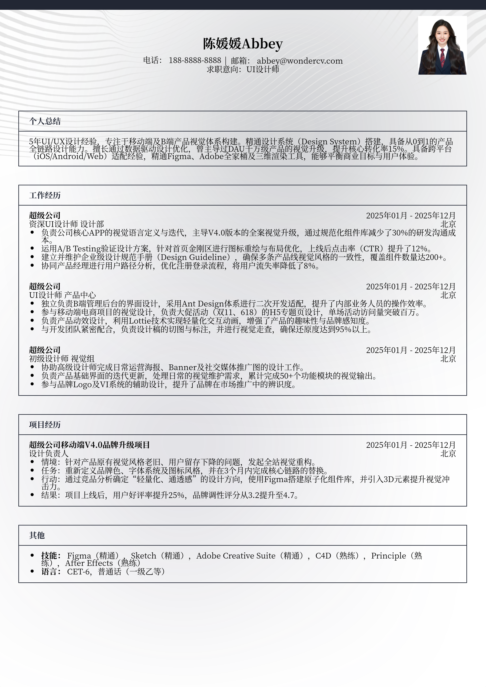

# 3-5年经验UI设计师求职简历模板

> 3-5年经验UI设计师求职简历模板UI设计师简历模板，适合工作3～5年招聘投递，也适合其他相关岗位简历参考

## 模板信息

| 项目 | 内容 |
|------|------|
| 适用岗位 | 社招简历、设计简历模板、UI/UX、互联网 |
| 语言 | 中文 |
| ATS 友好 | ✅ 是 |
| 已使用 | 824,567 次 |

## 标签

`社招简历` `设计简历模板` `UI/UX` `互联网`

## 模板特点

## 模板说明

这款针对3-5年经验UI设计师精心打造的简历模板，旨在帮助资深设计人才在激烈的社招竞争中脱颖而出。模板深度聚焦于中高级设计师所需的项目深度与逻辑表达，结构清晰地展示了从视觉设计到UX交互的全链路能力。它不仅提供了专业的排版布局，还针对互联网行业的审美趋势进行了优化，特别适合处于职业上升期、寻求进入大厂或核心岗位的UI/UX设计师。无论是移动端APP迭代还是B端复杂系统设计，该模板都能完美承载您的专业产出。您可通过下方的模板摘取您需要的内容，然后使用我们AI驱动的简历生成器生成简历。

- 科学布局，完美平衡视觉与逻辑
- 突出量化成果，展现设计商业价值
- 专为3-5年经验社招场景深度定制
- 模块化设计，快速适配UI/UX岗位
- 兼容大厂筛选标准的专业描述范式

## 适用场景

- 校招 / 社招投递
- 简历换新 / 定向改写
- 投递互联网、金融、咨询等主流行业

## 如何使用

1. 点击下方链接打开超级简历编辑器
2. 选择此模板，填写个人信息
3. 导出 PDF，直接投递

[👉 立即使用此模板](https://wondercv.com/sample/bw39LTec)

---

> 更多模板：[超级简历模板库](https://github.com/WonderCV-com/resume-templates) | 官网：[wondercv.com](https://wondercv.com)
