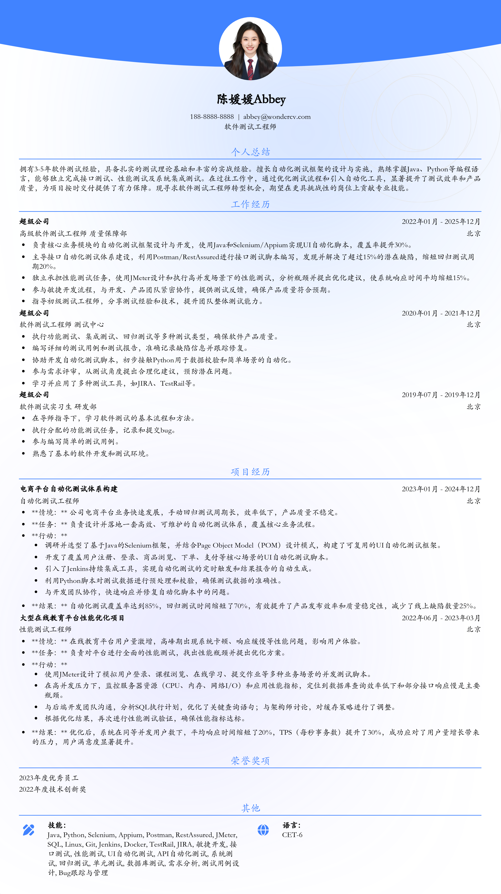

# 软件测试工程师转型简历模板

> 软件测试工程师转型简历模板，适合3-5年工作经验的软件测试工程师招聘投递，也适合其他相关岗位简历参考

## 模板信息

| 项目 | 内容 |
|------|------|
| 适用岗位 | Java |
| 语言 | 中文 |
| ATS 友好 | ✅ 是 |
| 已使用 | 789,456 次 |

## 标签

`Java`

## 模板特点

- 布局清晰，信息层次分明，招聘官一眼定位关键信息
- 字体与排版经过专业设计师优化，纸质与电子版均适配
- ATS 系统可正常解析，避免关键词被过滤
- 支持在线编辑，直接填写内容即可导出 PDF

## 适用场景

- 校招 / 社招投递
- 简历换新 / 定向改写
- 投递互联网、金融、咨询等主流行业

## 如何使用

1. 点击下方链接打开超级简历编辑器
2. 选择此模板，填写个人信息
3. 导出 PDF，直接投递

[👉 立即使用此模板](https://www.wondercv.com/jianlimoban/48f63e721ef0f624.html)

---

> 更多模板：[超级简历模板库](https://github.com/WonderCV-com/resume-templates) | 官网：[wondercv.com](https://wondercv.com)
