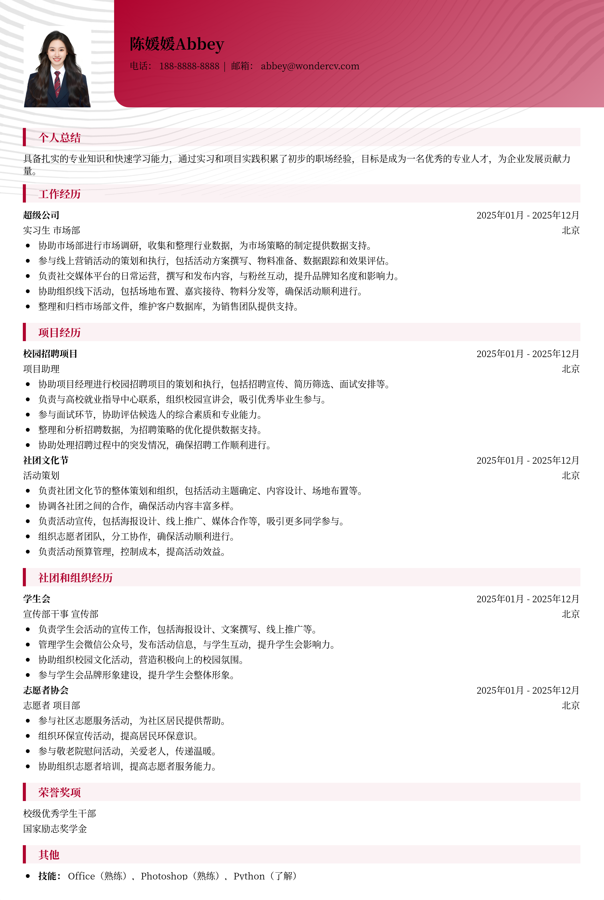

# 实习生通用简历模板

> 实习生通用简历模板，适合实习生招聘投递，也适合其他相关岗位简历参考

## 模板信息

| 项目 | 内容 |
|------|------|
| 适用岗位 | 校招、实习、大学生简历模板、实习生简历模板 |
| 语言 | 中文 |
| ATS 友好 | ✅ 是 |
| 已使用 | 837,156 次 |

## 标签

`校招` `实习` `大学生简历模板` `实习生简历模板`

## 模板特点

## 模板说明

这款实习生通用简历模板专为在校大学生和应届毕业生设计，无论你是初次踏入职场，还是希望在实习中积累经验，它都能帮助你清晰、高效地展示个人优势。模板结构简洁明了，重点突出教育背景、项目经历和技能特长，避免冗余信息，让HR能够快速捕捉到你的亮点。无论你申请的是技术、市场、运营还是其他类型的实习岗位，都可以根据自身情况灵活调整模板内容。还在为没有实习经历发愁吗？别担心，超级简历WonderCV教你如何巧妙运用课程项目，包装成吸引HR的实战经验！此外，模板也提供了丰富的排版样式和配色方案，方便你打造一份个性化的简历。告别千篇一律，用一份与众不同的简历赢得面试机会！您可通过下方的模板摘取您需要的内容，然后

- 通用性强，适用多种实习岗位
- 结构清晰，重点突出个人优势
- 简洁明了，避免信息冗余
- 排版美观，提升视觉吸引力
- 易于修改，快速生成简历

## 适用场景

- 校招 / 社招投递
- 简历换新 / 定向改写
- 投递互联网、金融、咨询等主流行业

## 如何使用

1. 点击下方链接打开超级简历编辑器
2. 选择此模板，填写个人信息
3. 导出 PDF，直接投递

[👉 立即使用此模板](https://wondercv.com/sample/SAcTpgU-)

---

> 更多模板：[超级简历模板库](https://github.com/WonderCV-com/resume-templates) | 官网：[wondercv.com](https://wondercv.com)
