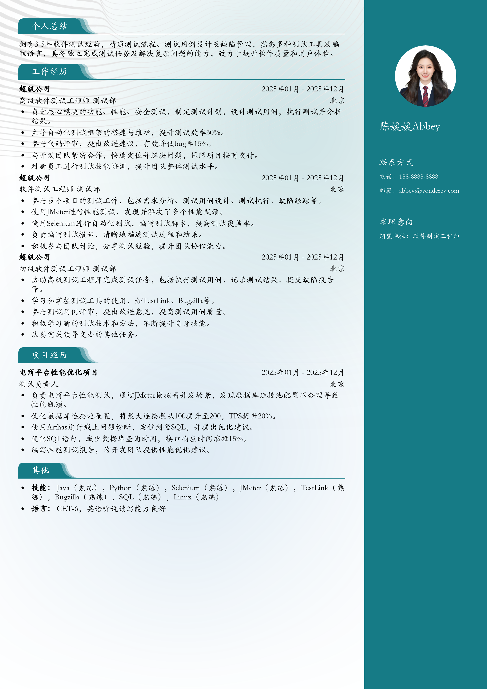

# 3-5年经验软件测试工程师晋升简历模板

> 3-5年经验软件测试工程师晋升简历模板，适合3～5年招聘投递，也适合其他相关岗位简历参考

## 模板信息

| 项目 | 内容 |
|------|------|
| 适用岗位 | 社招简历、跳槽简历、测试、软件工程 |
| 语言 | 中文 |
| ATS 友好 | ✅ 是 |
| 已使用 | 789,562 次 |

## 标签

`社招简历` `跳槽简历` `测试` `软件工程`

## 模板特点

## 模板说明

这款“3-5年经验软件测试工程师晋升简历模板”专为寻求职业晋升的软件测试工程师量身打造。如果您拥有3到5年的工作经验，并渴望在软件测试领域更上一层楼，这份模板将是您强有力的助推器。它不仅适用于跳槽，同样也适合在职晋升。模板结构清晰，重点突出，能有效展示您的专业技能、项目经验和个人优势，帮助您在众多求职者中脱颖而出。它能帮助您更好地呈现过往的测试项目经验，突出您在性能测试、自动化测试、安全测试等方面的专长。无论您是想进入大型互联网公司，还是寻求更具挑战性的职位，这份模板都能帮助您打造一份令人印象深刻的简历。您可通过下方的模板摘取您需要的内容，然后使用我们AI驱动的简历生成器生成简历。

- 突出3-5年软件测试经验
- 针对晋升目标优化内容
- 专业排版，重点突出技能
- 适用于跳槽和在职晋升
- 可定制化，灵活调整模块

## 适用场景

- 校招 / 社招投递
- 简历换新 / 定向改写
- 投递互联网、金融、咨询等主流行业

## 如何使用

1. 点击下方链接打开超级简历编辑器
2. 选择此模板，填写个人信息
3. 导出 PDF，直接投递

[👉 立即使用此模板](https://wondercv.com/resumes/new?sample_cv_token=731a5e4297bc7d4c)

---

> 更多模板：[超级简历模板库](https://github.com/WonderCV-com/resume-templates) | 官网：[wondercv.com](https://wondercv.com)
