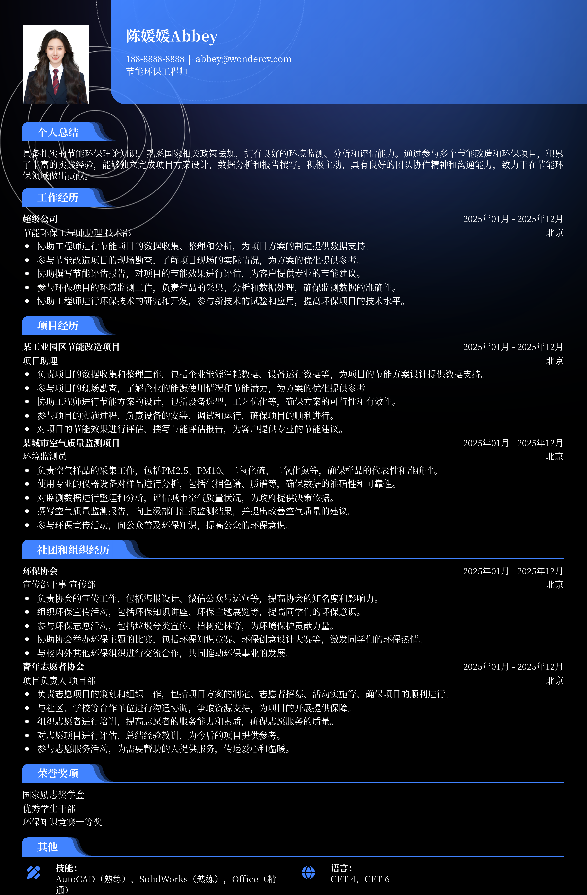

# 2026节能环保工程师应届生简历模板

> 2026节能环保工程师应届生简历模板，适合应届生招聘投递，也适合其他相关岗位简历参考

## 模板信息

| 项目 | 内容 |
|------|------|
| 适用岗位 | 应届生简历模板、求职简历模板、实习生简历模板、校招简历 |
| 语言 | 中文 |
| ATS 友好 | ✅ 是 |
| 已使用 | 789,562 次 |

## 标签

`应届生简历模板` `求职简历模板` `实习生简历模板` `校招简历`

## 模板特点

## 模板说明

这款“2026节能环保工程师应届生简历模板”专为即将踏入职场的环保领域应届毕业生设计。它以简洁明了的排版，突出你的专业技能和项目经验，帮助你在众多求职者中脱颖而出。模板结构清晰，包含个人信息、教育背景、实习经历、项目经验、技能证书等模块，方便HR快速了解你的优势。无论你是环境工程、资源循环科学与工程还是相关专业的学生，都可以轻松使用此模板。它不仅适用于应届生招聘，也同样适合其他相关岗位的简历参考，助你敲开理想职业的大门。在实习经历方面，可以参考实习生简历模板和范文进行润色。您可通过下方的模板摘取您需要的内容，然后使用我们AI驱动的简历生成器生成简历。

- 专为环保工程师应届生设计
- 突出专业技能和项目经验
- 简洁明了的排版易于阅读
- 包含关键简历模块，结构清晰
- 适用于校招和实习岗位投递

## 适用场景

- 校招 / 社招投递
- 简历换新 / 定向改写
- 投递互联网、金融、咨询等主流行业

## 如何使用

1. 点击下方链接打开超级简历编辑器
2. 选择此模板，填写个人信息
3. 导出 PDF，直接投递

[👉 立即使用此模板](https://wondercv.com/resumes/new?sample_cv_token=7ed2a4484ccaff4c)

---

> 更多模板：[超级简历模板库](https://github.com/WonderCV-com/resume-templates) | 官网：[wondercv.com](https://wondercv.com)
