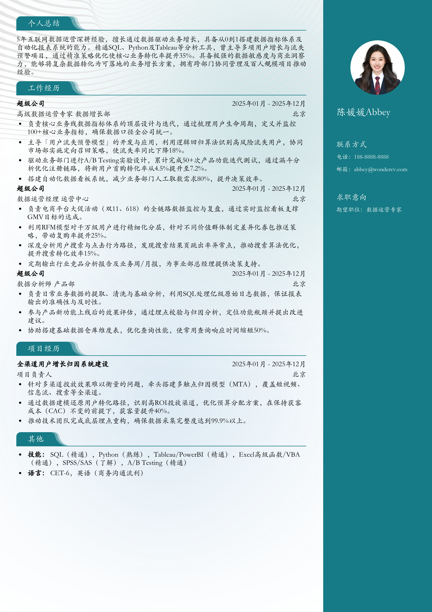

# 3-5年经验数据运营专家跳槽简历模板

> 3-5年经验数据运营专家跳槽简历模板数据运营专家简历模板，适合工作3～5年招聘投递，也适合其他相关岗位简历参考

## 模板信息

| 项目 | 内容 |
|------|------|
| 适用岗位 | 社招简历、跳槽简历、数据分析、互联网 |
| 语言 | 中文 |
| ATS 友好 | ✅ 是 |
| 已使用 | 856,423 次 |

## 标签

`社招简历` `跳槽简历` `数据分析` `互联网`

## 模板特点

## 模板说明

本模板专为拥有3-5年工作经验的数据运营专家量身定制，深度契合互联网大厂及高增长科技企业对中高级人才的需求。模板结构严谨，重点突出候选人在业务增长、用户画像分析及策略落地方面的实战成果，能够完美展示从业者从基础执行向策略专家转型的专业能力。无论您是计划在同领域内寻找更高职级，还是寻求跨行业的职业突破，本模板都能为您提供标准化的行业范式，助您在激烈的社招竞争中脱颖而出。您可通过下方的模板摘取您需要的内容，然后使用我们AI驱动的简历生成器生成简历。

- 量化数据增长，凸显核心业务价值
- 专业模块划分，展示策略运营深度
- 适配大厂审美，排版简洁逻辑清晰
- 强调技术栈组合，体现复合型背景
- 针对跳槽场景，优化项目成果展示

## 适用场景

- 校招 / 社招投递
- 简历换新 / 定向改写
- 投递互联网、金融、咨询等主流行业

## 如何使用

1. 点击下方链接打开超级简历编辑器
2. 选择此模板，填写个人信息
3. 导出 PDF，直接投递

[👉 立即使用此模板](https://wondercv.com/sample/N20JfQC9)

---

> 更多模板：[超级简历模板库](https://github.com/WonderCV-com/resume-templates) | 官网：[wondercv.com](https://wondercv.com)
