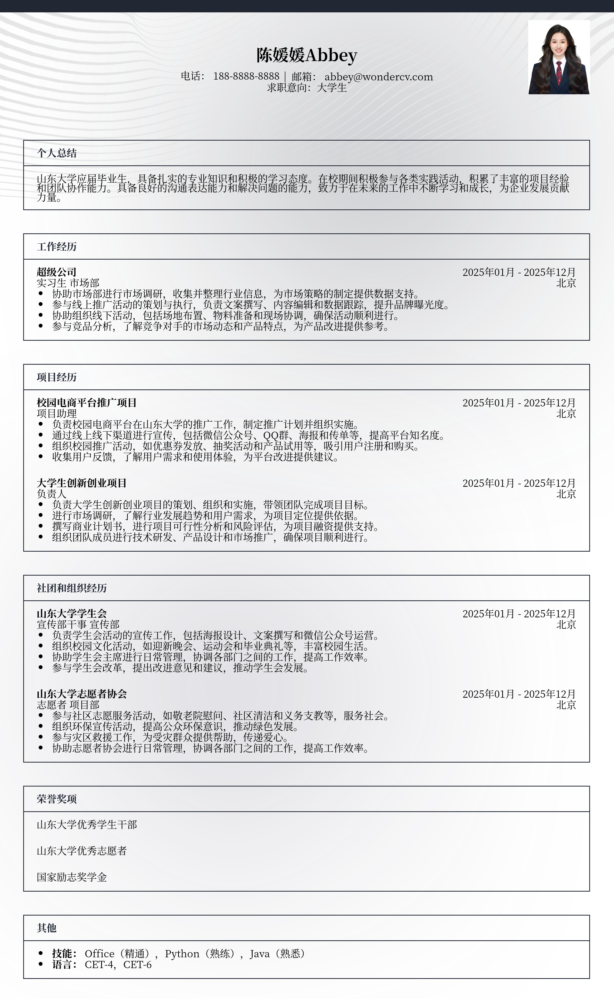

# 山东大学大学生简历模板

> 山东大学大学生简历模板，适合应届生招聘投递，也适合其他相关岗位简历参考

## 模板信息

| 项目 | 内容 |
|------|------|
| 适用岗位 | 热门推荐、实习、大学生简历模板、校招简历 |
| 语言 | 中文 |
| ATS 友好 | ✅ 是 |
| 已使用 | 789,562 次 |

## 标签

`热门推荐` `实习` `大学生简历模板` `校招简历`

## 模板特点

## 模板说明

这款“山东大学大学生简历模板”专为山东大学的学子量身打造，同时也非常适合其他高校的应届毕业生以及需要进行岗位调整的求职者参考。模板设计简洁大方，重点突出个人优势与实践经历，能够帮助你在众多简历中脱颖而出。无论你是正在寻找实习机会，还是准备参加校园招聘，这款模板都能助你一臂之力。它结构清晰，易于修改，方便你根据自身情况进行个性化定制，充分展现你的学术背景、项目经验和个人技能。通过合理排版和重点突出，让你的简历更具吸引力，给HR留下深刻印象。您可通过下方的模板摘取您需要的内容，然后使用我们AI驱动的简历生成器生成简历。

- 专为大学生设计，贴合校招需求
- 突出学术背景，展现专业实力
- 结构清晰，方便内容填充
- 简洁大方，易于HR快速浏览
- 可灵活修改，个性化定制

## 适用场景

- 校招 / 社招投递
- 简历换新 / 定向改写
- 投递互联网、金融、咨询等主流行业

## 如何使用

1. 点击下方链接打开超级简历编辑器
2. 选择此模板，填写个人信息
3. 导出 PDF，直接投递

[👉 立即使用此模板](https://wondercv.com/sample/IJzWy9LS)

---

> 更多模板：[超级简历模板库](https://github.com/WonderCV-com/resume-templates) | 官网：[wondercv.com](https://wondercv.com)
