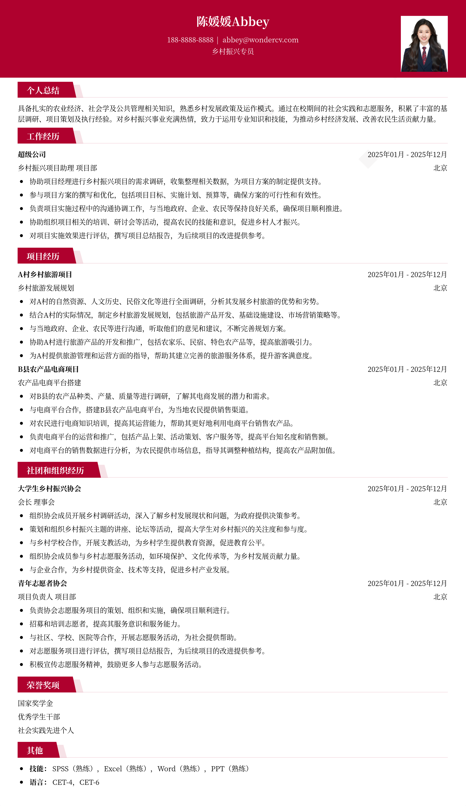

# 2026乡村振兴专员校招简历模板

> 2026乡村振兴专员校招简历模板，适合应届生招聘投递，也适合其他相关岗位简历参考

## 模板信息

| 项目 | 内容 |
|------|------|
| 适用岗位 | 应届生简历模板、求职简历模板、校招简历、免费简历模板 |
| 语言 | 中文 |
| ATS 友好 | ✅ 是 |
| 已使用 | 789,562 次 |

## 标签

`应届生简历模板` `求职简历模板` `校招简历` `免费简历模板`

## 模板特点

## 模板说明

这款“2026乡村振兴专员校招简历模板”专为有志于投身乡村建设的应届毕业生量身打造。它不仅适用于校招，也同样能为其他相关岗位的求职者提供参考。模板设计简洁大方，重点突出个人在相关领域的实习经历、项目经验以及专业技能，能够帮助你清晰地展现自身优势，给HR留下深刻印象。它充分考虑了乡村振兴专员岗位所需的综合素质，例如沟通协调能力、基层工作经验等，并提供相应的展示空间。无论你是农学、社会学、经济学等相关专业的学生，都可以利用这款模板快速构建一份高质量的简历。同时，我们也考虑到应届生在简历制作方面的经验不足，模板提供了详细的填写指导和优化建议，助你避开常见的简历误区。您可通过下方的模板摘取您需要的内容

- 专为乡村振兴岗位设计
- 突出基层工作经验
- 简洁大方，重点突出
- 包含详细填写指导
- 适用于多种相关专业

## 适用场景

- 校招 / 社招投递
- 简历换新 / 定向改写
- 投递互联网、金融、咨询等主流行业

## 如何使用

1. 点击下方链接打开超级简历编辑器
2. 选择此模板，填写个人信息
3. 导出 PDF，直接投递

[👉 立即使用此模板](https://wondercv.com/sample/JEkgyuko)

---

> 更多模板：[超级简历模板库](https://github.com/WonderCV-com/resume-templates) | 官网：[wondercv.com](https://wondercv.com)
