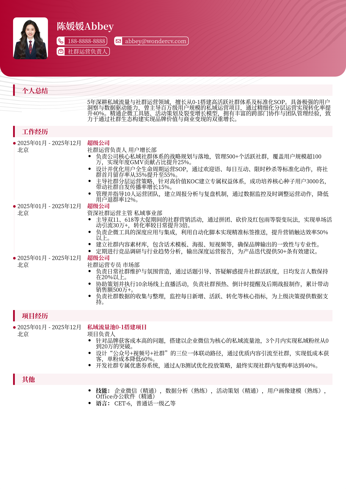

# 3-5年经验社群运营负责人跳槽简历模板

> 3-5年经验社群运营负责人跳槽简历模板社群运营负责人简历模板，适合工作3～5年招聘投递，也适合其他相关岗位简历参考

## 模板信息

| 项目 | 内容 |
|------|------|
| 适用岗位 | 社招简历、运营简历模板、数据分析、互联网 |
| 语言 | 中文 |
| ATS 友好 | ✅ 是 |
| 已使用 | 856,423 次 |

## 标签

`社招简历` `运营简历模板` `数据分析` `互联网`

## 模板特点

## 模板说明

本模板专为拥有3-5年经验的社群运营负责人量身定制，深度契合互联网行业对私域流量管理、用户增长及团队领导力的考核标准。模板重点突出了社群架构搭建、转化模型优化以及数据驱动运营的核心能力，通过结构化的排版展示您在提升用户活跃度与GMV方面的实战成果。无论您是寻求更高职级的管理岗位，还是跨赛道转型，本模板都能帮助您精准提炼职业高光。您可通过下方的模板摘取您需要的内容，然后使用我们AI驱动的简历生成器生成简历。

- 突出社群架构搭建与体系化运营能力
- 强调数据驱动决策与转化链路优化
- 展现3-5年资深团队管理与协作经验
- 量化关键指标如活跃率、转化率及GMV
- 适配互联网大厂及私域运营核心岗位

## 适用场景

- 校招 / 社招投递
- 简历换新 / 定向改写
- 投递互联网、金融、咨询等主流行业

## 如何使用

1. 点击下方链接打开超级简历编辑器
2. 选择此模板，填写个人信息
3. 导出 PDF，直接投递

[👉 立即使用此模板](https://wondercv.com/sample/JwmA55u_)

---

> 更多模板：[超级简历模板库](https://github.com/WonderCV-com/resume-templates) | 官网：[wondercv.com](https://wondercv.com)
