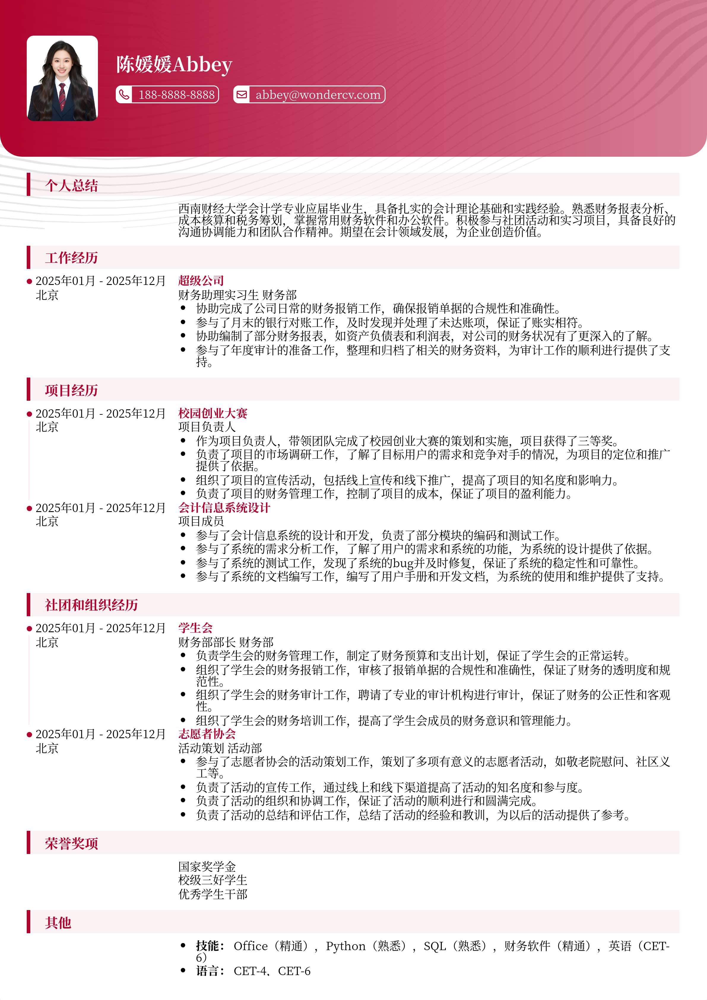

# 西南财经大学应届生简历模板

> 西南财经大学应届生简历模板，适合应届生招聘投递，也适合其他相关岗位简历参考

## 模板信息

| 项目 | 内容 |
|------|------|
| 适用岗位 | 应届生简历模板、高校简历、求职简历模板、校招简历 |
| 语言 | 中文 |
| ATS 友好 | ✅ 是 |
| 已使用 | 789,562 次 |

## 标签

`应届生简历模板` `高校简历` `求职简历模板` `校招简历`

## 模板特点

## 模板说明

这款“西南财经大学应届生简历模板”专为即将踏入职场的西财学子量身打造，同时也适用于其他高校应届毕业生及寻求相关岗位的求职者。模板设计简洁大方，重点突出求职者的教育背景、专业技能和实践经历，充分展现你在校期间的学术能力和综合素质。它能帮助你清晰地呈现个人优势，让HR眼前一亮。对于缺乏工作经验的应届生来说，一份精心设计的简历至关重要。该模板充分考虑了应届生的特点，引导你突出自身优势，扬长避短，增加获得面试的机会。它能帮助你更好地展示你的能力和潜力，让你的简历在众多求职者中脱颖而出。您可通过下方的模板摘取您需要的内容，然后使用我们AI驱动的简历生成器生成简历。

- 专为西财学子设计，贴合学校特色
- 简洁大方，重点突出，易于阅读
- 突出教育背景和专业技能
- 强调实践经历，展现综合素质
- 适用于应届生和相关岗位求职者

## 适用场景

- 校招 / 社招投递
- 简历换新 / 定向改写
- 投递互联网、金融、咨询等主流行业

## 如何使用

1. 点击下方链接打开超级简历编辑器
2. 选择此模板，填写个人信息
3. 导出 PDF，直接投递

[👉 立即使用此模板](https://wondercv.com/resumes/new?sample_cv_token=c43cce0de5ca3add)

---

> 更多模板：[超级简历模板库](https://github.com/WonderCV-com/resume-templates) | 官网：[wondercv.com](https://wondercv.com)
