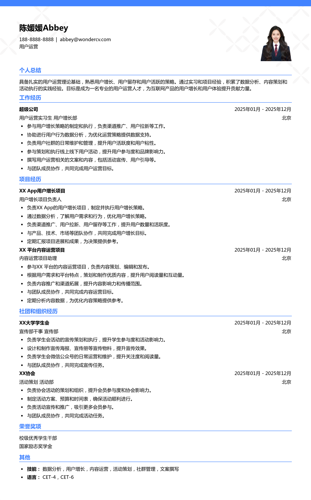

# 2026用户运营应届生简历模板

> 2026用户运营应届生简历模板，适合应届生招聘投递，也适合其他相关岗位简历参考

## 模板信息

| 项目 | 内容 |
|------|------|
| 适用岗位 | 应届生简历模板、求职简历模板、校招简历 |
| 语言 | 中文 |
| ATS 友好 | ✅ 是 |
| 已使用 | 845,122 次 |

## 标签

`应届生简历模板` `求职简历模板` `校招简历`

## 模板特点

## 模板说明

这款“2026用户运营应届生简历模板”专为寻求用户运营相关岗位的应届毕业生量身打造。它结构清晰，重点突出，能够帮助你在众多求职者中脱颖而出。模板的设计充分考虑了用户运营岗位的特点，强调沟通、数据分析和用户洞察能力。无论你是市场营销、传播学还是其他相关专业的学生，都可以轻松上手，快速生成一份专业的简历。此模板也同样适用于其他相关岗位的求职者参考，学习其排版和内容组织方式。它不仅能帮助你展示个人优势，还能让你了解HR在筛选用户运营岗位简历时更看重哪些方面。您可通过下方的模板摘取您需要的内容，然后使用我们AI驱动的简历生成器生成简历。

- 突出用户洞察与分析能力
- 强调沟通和协调能力
- 简洁明了，重点突出
- 适用于应届生求职
- 可灵活修改，适应不同需求

## 适用场景

- 校招 / 社招投递
- 简历换新 / 定向改写
- 投递互联网、金融、咨询等主流行业

## 如何使用

1. 点击下方链接打开超级简历编辑器
2. 选择此模板，填写个人信息
3. 导出 PDF，直接投递

[👉 立即使用此模板](https://wondercv.com/sample/ywxv9ZRP)

---

> 更多模板：[超级简历模板库](https://github.com/WonderCV-com/resume-templates) | 官网：[wondercv.com](https://wondercv.com)
