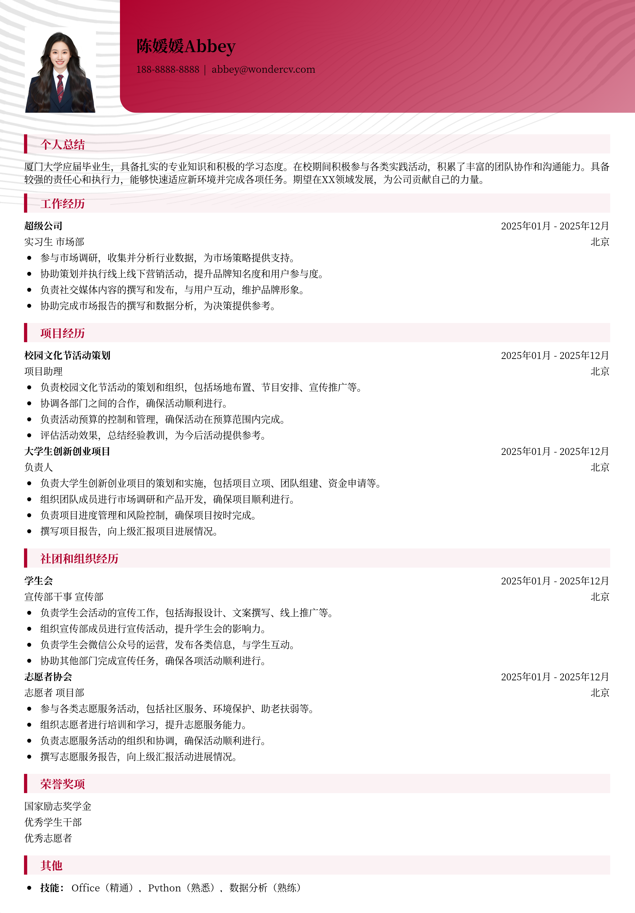

# 厦门大学应届生简历模板

> 厦门大学应届生简历模板，适合应届生招聘投递，也适合其他相关岗位简历参考

## 模板信息

| 项目 | 内容 |
|------|------|
| 适用岗位 | 应届生简历模板、求职简历模板、实习生简历模板、校招简历 |
| 语言 | 中文 |
| ATS 友好 | ✅ 是 |
| 已使用 | 789,562 次 |

## 标签

`应届生简历模板` `求职简历模板` `实习生简历模板` `校招简历`

## 模板特点

## 模板说明

这款“厦门大学应届生简历模板”专为即将踏入职场的应届毕业生设计，尤其适合厦门大学及其他高校的毕业生。模板风格简约大气，重点突出教育背景、实习经历和个人技能，帮助你在众多求职者中脱颖而出。无论你是想申请实习岗位还是参加校园招聘，这个模板都能满足你的需求。它结构清晰，易于编辑，方便你快速创建一份专业且个性化的简历。充分展示你的学术优势、实践经验和个人特长，给HR留下深刻的印象。同时，也适合有少量工作经验但希望突出个人优势的求职者。让你的简历更具竞争力，增加获得面试的机会。您可通过下方的模板摘取您需要的内容，然后使用我们AI驱动的简历生成器生成简历。

- 专为应届生设计，突出优势
- 简约大气，易于编辑修改
- 重点展示教育背景和技能
- 适合实习和校招投递
- 助力快速生成专业简历

## 适用场景

- 校招 / 社招投递
- 简历换新 / 定向改写
- 投递互联网、金融、咨询等主流行业

## 如何使用

1. 点击下方链接打开超级简历编辑器
2. 选择此模板，填写个人信息
3. 导出 PDF，直接投递

[👉 立即使用此模板](https://wondercv.com/sample/jNOdvlfN)

---

> 更多模板：[超级简历模板库](https://github.com/WonderCV-com/resume-templates) | 官网：[wondercv.com](https://wondercv.com)
