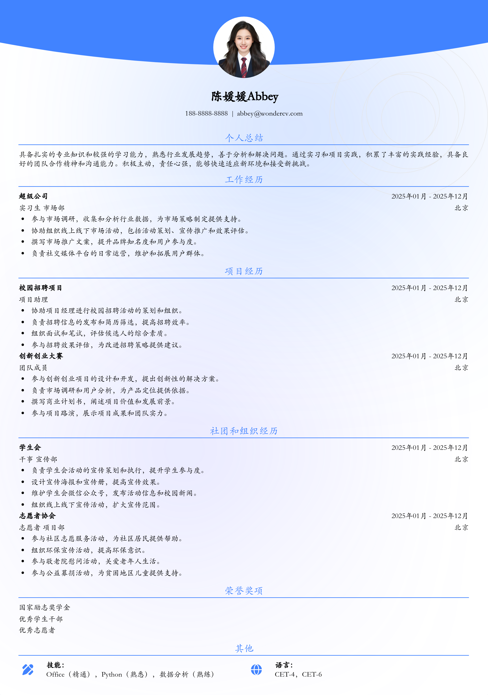

# 应届生通用简历模板

> 应届生通用简历模板，适合应届生招聘投递，也适合其他相关岗位简历参考

## 模板信息

| 项目 | 内容 |
|------|------|
| 适用岗位 | 应届生简历模板、实习、求职简历模板、校招简历 |
| 语言 | 中文 |
| ATS 友好 | ✅ 是 |
| 已使用 | 975,639 次 |

## 标签

`应届生简历模板` `实习` `求职简历模板` `校招简历`

## 模板特点

## 模板说明

这款应届生通用简历模板，专为即将踏入职场的同学们量身打造。它简约大方，重点突出，能够帮助你清晰地展示个人优势和亮点，在众多求职者中脱颖而出。无论你是正在寻找实习机会，还是准备参加秋季校园招聘，这个模板都能满足你的需求。模板结构清晰，包含个人信息、教育背景、实习经历、项目经验、技能特长等必备模块，方便你快速填充内容。即使你没有丰富的实习经验，也能通过突出校园经历和项目经验来弥补。此外，模板设计简洁现代，易于阅读，能给HR留下良好的第一印象。这款模板也适合有一定工作经验，但想转行或者寻找新机会的人群。您可通过下方的模板摘取您需要的内容，然后使用我们AI驱动的简历生成器生成简历。

- 通用性强，适合多种岗位
- 简约设计，重点突出
- 结构清晰，易于填写
- 突出优势，弥补经验不足
- 免费下载，方便快捷

## 适用场景

- 校招 / 社招投递
- 简历换新 / 定向改写
- 投递互联网、金融、咨询等主流行业

## 如何使用

1. 点击下方链接打开超级简历编辑器
2. 选择此模板，填写个人信息
3. 导出 PDF，直接投递

[👉 立即使用此模板](https://wondercv.com/sample/ZxMygqMP)

---

> 更多模板：[超级简历模板库](https://github.com/WonderCV-com/resume-templates) | 官网：[wondercv.com](https://wondercv.com)
