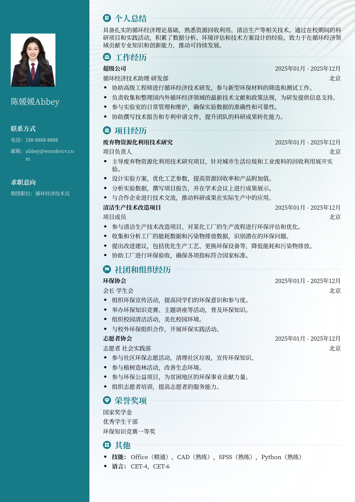

# 2026循环经济技术员校招模板

> 2026循环经济技术员校招模板，适合应届生招聘投递，也适合其他相关岗位简历参考

## 模板信息

| 项目 | 内容 |
|------|------|
| 适用岗位 | 应届生简历模板、实习生简历模板、校招简历、免费简历模板 |
| 语言 | 中文 |
| ATS 友好 | ✅ 是 |
| 已使用 | 789,562 次 |

## 标签

`应届生简历模板` `实习生简历模板` `校招简历` `免费简历模板`

## 模板特点

## 模板说明

这款“2026循环经济技术员校招模板”专为应届毕业生量身打造，同样适用于其他相关岗位的求职者参考。模板设计简洁现代，重点突出个人技能和实践经验，帮助你在众多求职者中脱颖而出。无论你是否有相关工作经验，都可以通过修改模板内容，展示你在循环经济领域的热情和潜力。模板结构清晰，易于编辑，方便你快速制作一份专业、高效的简历。特别适合申请循环经济技术员、环保工程师、可持续发展专员等职位。使用此模板，你将能够清晰地呈现你的教育背景、实习经历、项目经验和技能特长，给招聘方留下深刻印象。您可通过下方的模板摘取您需要的内容，然后使用我们AI驱动的简历生成器生成简历。

- 专为循环经济技术员校招设计
- 突出应届生优势与潜力
- 结构清晰，易于编辑修改
- 适用于多种相关岗位
- 简洁现代，专业高效

## 适用场景

- 校招 / 社招投递
- 简历换新 / 定向改写
- 投递互联网、金融、咨询等主流行业

## 如何使用

1. 点击下方链接打开超级简历编辑器
2. 选择此模板，填写个人信息
3. 导出 PDF，直接投递

[👉 立即使用此模板](https://wondercv.com/sample/Lfw-24pV)

---

> 更多模板：[超级简历模板库](https://github.com/WonderCV-com/resume-templates) | 官网：[wondercv.com](https://wondercv.com)
