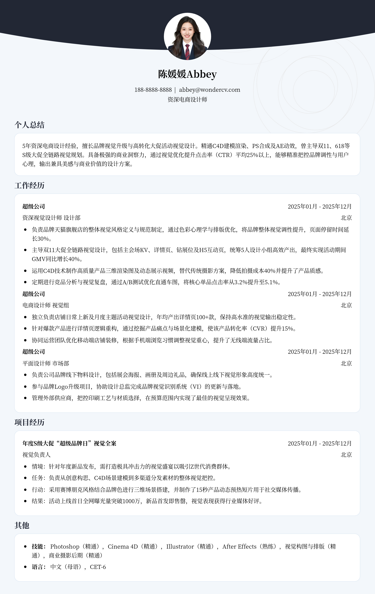

# 3-5年经验电商设计师求职简历模板

> 3-5年经验电商设计师求职简历模板资深电商设计师简历模板，适合工作3～5年招聘投递，也适合其他相关岗位简历参考

## 模板信息

| 项目 | 内容 |
|------|------|
| 适用岗位 | 社招简历、设计简历模板、UI/UX、平面设计/美工 |
| 语言 | 中文 |
| ATS 友好 | ✅ 是 |
| 已使用 | 824,567 次 |

## 标签

`社招简历` `设计简历模板` `UI/UX` `平面设计/美工`

## 模板特点

## 模板说明

这款针对3-5年经验的资深电商设计师简历模板，专为寻求职业进阶的设计人才量身打造。模板深度结合了电商行业高频的业务场景，如大促活动视觉设计、品牌升级及高转化详情页优化等，通过结构化的排版突出候选人的商业逻辑与审美表达。无论您是专注于天猫京东的美工大牛，还是转型UI/UX的跨界设计师，本模板都能帮助您清晰呈现项目成果与核心竞争力，在激烈的社招竞争中脱颖而出。您可通过下方的模板摘取您需要的内容，然后使用我们AI驱动的简历生成器生成简历。

- 量化设计产出，突出转化率指标
- 职场进阶布局，彰显资深专业度
- 模块化项目描述，适配大促经验
- 设计规范与品牌思维的完美结合
- 视觉排版优美，符合设计师审美

## 适用场景

- 校招 / 社招投递
- 简历换新 / 定向改写
- 投递互联网、金融、咨询等主流行业

## 如何使用

1. 点击下方链接打开超级简历编辑器
2. 选择此模板，填写个人信息
3. 导出 PDF，直接投递

[👉 立即使用此模板](https://www.wondercv.com/jianlimoban/eb234a29f78e3036.html)

---

> 更多模板：[超级简历模板库](https://github.com/WonderCV-com/resume-templates) | 官网：[wondercv.com](https://wondercv.com)
