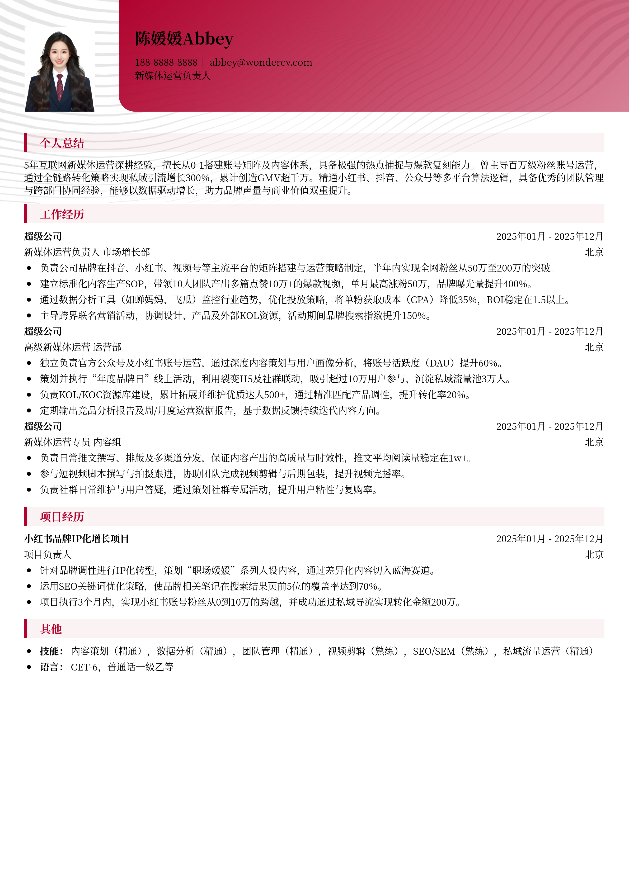

# 3-5年经验新媒体运营负责人简历模板

> 3-5年经验新媒体运营负责人简历模板新媒体运营负责人简历模板，适合社招招聘投递，也适合其他相关岗位简历参考

## 模板信息

| 项目 | 内容 |
|------|------|
| 适用岗位 | 新媒体、运营简历模板、社招简历、互联网 |
| 语言 | 中文 |
| ATS 友好 | ✅ 是 |
| 已使用 | 864,251 次 |

## 标签

`新媒体` `运营简历模板` `社招简历` `互联网`

## 模板特点

## 模板说明

这款3-5年经验的新媒体运营负责人简历模板，专为处于职业上升期的互联网运营人打造。模板深度聚焦中高级管理岗位的核心诉求，重点展示账号矩阵搭建、千万级流量增长、团队协同管理及商业化变现等高价值经验。版式设计简洁干练，符合社招HR筛选习惯，能够帮助候选人清晰呈现从策略制定到结果产出的全链路能力。无论您是寻求跨平台晋升，还是跨行业转型，都能通过此模板精准对标名企要求。您可通过下方的模板摘取您需要的内容，然后使用我们AI驱动的简历生成器生成简历。

- 量化数据导向，突出增长实绩
- 职能模块清晰，对标管理岗位
- 专业术语精准，展现行业深度
- 排版层次分明，提升阅读效率
- 覆盖全平台运营，强调矩阵思维

## 适用场景

- 校招 / 社招投递
- 简历换新 / 定向改写
- 投递互联网、金融、咨询等主流行业

## 如何使用

1. 点击下方链接打开超级简历编辑器
2. 选择此模板，填写个人信息
3. 导出 PDF，直接投递

[👉 立即使用此模板](https://wondercv.com/resumes/new?sample_cv_token=f9895d2a55bdf6eb)

---

> 更多模板：[超级简历模板库](https://github.com/WonderCV-com/resume-templates) | 官网：[wondercv.com](https://wondercv.com)
